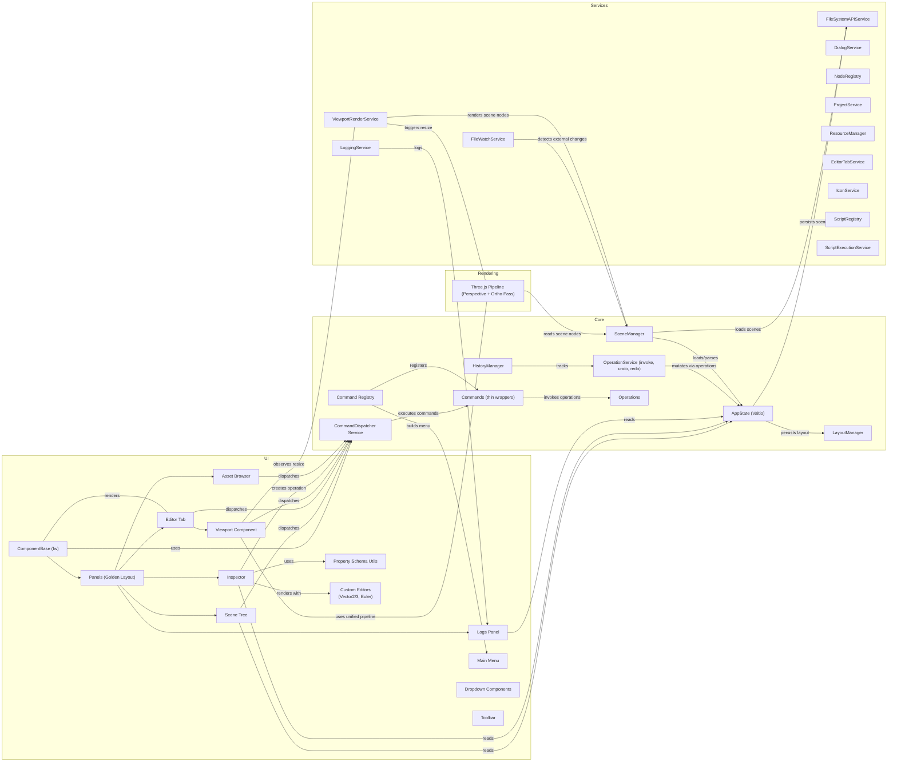
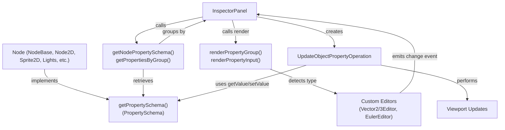
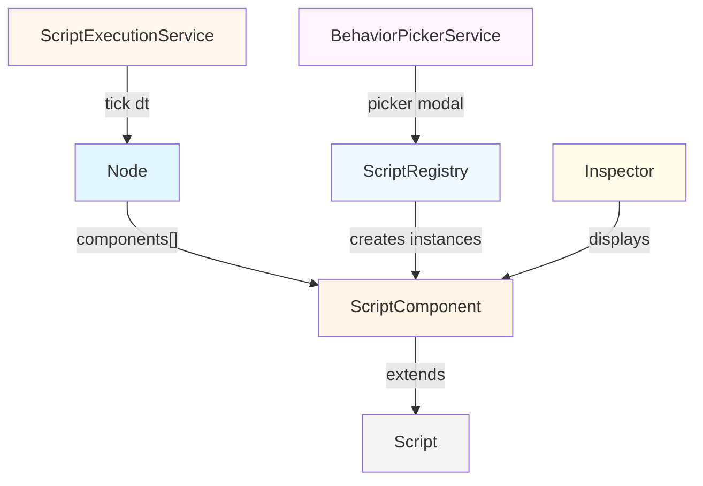
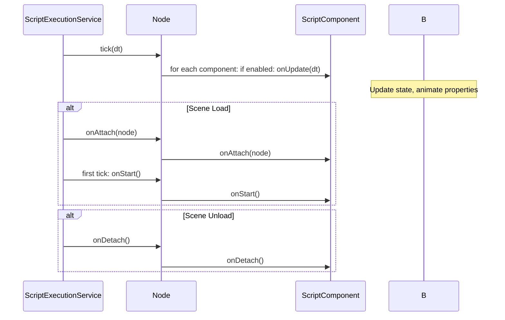
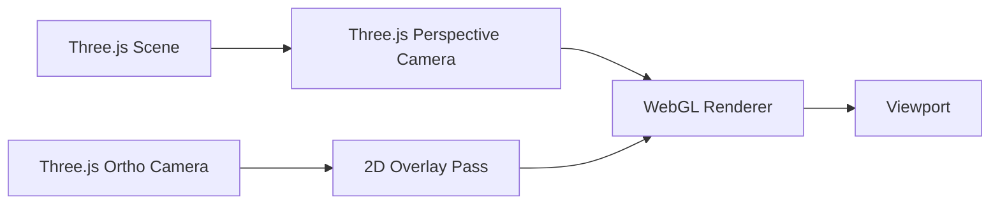
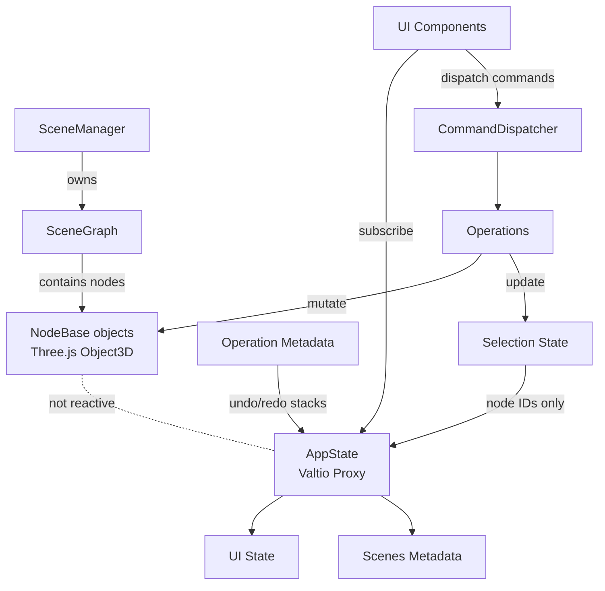

# Pix3 Architecture Diagram

This document contains a high-level architecture diagram for Pix3 and notes about viewing and exporting diagrams in VS Code. It reflects the current operations-first model where the CommandDispatcher Service is the primary entry point for all actions, ensuring consistent lifecycle management and preconditions checking. This version also includes the Script Component System for behaviors and controllers.

## Mermaid diagram

Below is a Mermaid system diagram that represents the architecture described in `pix3-specification.md` (v1.13, operations-first).



## Property Schema System

Pix3 uses a **property schema system** (Godot-inspired) for dynamic object inspector UI generation. This replaces hardcoded property editors with declarative type information.

### Architecture Flow



### Key Components

- **PropertySchema**: Defines typed property metadata for a node class, including nodeType, properties array, and optional groups
- **PropertyDefinition**: Individual property with name, type, getValue/setValue closures, UI hints (label, group, step, precision, unit, min, max)
- **PropertyType**: Union type including `'string'`, `'number'`, `'boolean'`, `'vector2'`, `'vector3'`, `'vector4'`, `'euler'`, `'color'`, `'enum'`, `'select'`, `'object'`
- **Custom Editors**: Web Components (`Vector2Editor`, `Vector3Editor`, `EulerEditor`) for grouped vector display
- **Grid Layout**: Transform properties use 6-column CSS Grid (1rem 1fr 1rem 1fr 1rem 1fr) with color-coded X/Y/Z labels
- **UpdateObjectPropertyOperation**: Uses schema's getValue/setValue for semantic transformations (e.g., radian/degree conversion)

### Creating a Node Schema

Node classes implement `getPropertySchema()` returning typed property definitions:

```typescript
export class Sprite2D extends Node2D {
  static getPropertySchema(): PropertySchema {
    return {
      ...Node2D.getPropertySchema(),
      nodeType: 'Sprite2D',
      extends: 'Node2D',
      properties: [
        ...Node2D.getPropertySchema().properties,
        {
          name: 'texture',
          type: 'string',
          ui: {
            label: 'Texture',
            group: 'Sprite',
          },
          getValue: node => (node as Sprite2D).textureUrl || '',
          setValue: (node, value) => {
            // Custom logic here
          },
        },
      ],
    };
  }
}
```

### Property Type Support

| Type        | Display                  | Usage                      |
| ----------- | ------------------------ | -------------------------- |
| `'string'`  | Text input               | Names, URLs, IDs           |
| `'number'`  | Number input             | Dimensions, angles, values |
| `'boolean'` | Checkbox                 | Flags, toggles             |
| `'vector2'` | Grid with X/Y inputs     | 2D positions, scales       |
| `'vector3'` | Grid with X/Y/Z inputs   | 3D positions, scales       |
| `'vector4'` | Grid with X/Y/Z/W inputs | Colors (RGBA), quaternions |
| `'euler'`   | Grid with X/Y/Z° inputs  | 3D rotations (degrees)     |
| `'color'`   | Color picker             | Tint, highlight colors     |
| `'enum'`    | Dropdown                 | Predefined choices         |
| `'select'`  | List picker              | Option selection           |
| `'object'`  | Nested object            | Complex data structures    |

### Grid Layout for Transform Properties

Transform group (position, rotation, scale) renders as 6-column grid with color-coded axes:

```css
.transform-fields {
  display: grid;
  grid-template-columns: 1rem 1fr 1rem 1fr 1rem 1fr;
  gap: 0.5rem;
  padding: 0.5rem;
}

.transform-field-label {
  display: flex;
  align-items: center;
  justify-content: center;
  font-weight: bold;
}

/* Color-coded X/Y/Z labels */
.transform-field-label:nth-child(1) {
  color: #ff6b6b;
} /* X - red */
.transform-field-label:nth-child(3) {
  color: #51cf66;
} /* Y - green */
.transform-field-label:nth-child(5) {
  color: #4c6ef5;
} /* Z - blue */
```

Result: Single-row display with compact axis labels and inline numeric inputs.

## Command-Driven Menu System

Menu items are generated from registered commands using metadata. This pattern replaces hardcoded menu structures with a flexible, extensible approach.

### CommandMetadata Extension

```typescript
interface CommandMetadata {
  // ... existing properties ...
  readonly menuPath?: string; // 'edit', 'file', 'view', 'help'
  readonly shortcut?: string; // '⌘Z', 'Ctrl+S' (display only)
  readonly addToMenu?: boolean; // Include in main menu
  readonly menuOrder?: number; // Sort order (lower = earlier)
}
```

### Menu Generation Flow

1. Commands register with CommandRegistry at app startup
2. CommandRegistry.buildMenuSections() groups commands by menuPath and sorts by menuOrder
3. Pix3MainMenu loads sections and renders menu items
4. Menu clicks execute commands via CommandDispatcher

### Execution Path

```
User clicks menu item
  ↓
Pix3MainMenu.executeMenuItem(commandId)
  ↓
CommandDispatcher.execute(command)
  ↓
Preconditions checked → Command.execute()
  ↓
Operation performed via OperationService
  ↓
State updated → UI re-renders
```

### Example: Adding to Edit Menu

```typescript
export class MyCommand extends CommandBase<void, void> {
  readonly metadata: CommandMetadata = {
    id: 'edit.mycommand',
    title: 'My Command',
    menuPath: 'edit', // Groups under Edit menu
    shortcut: '⌘M',
    addToMenu: true,
    menuOrder: 10, // Sorts relative to other menu items
  };
  // ... implementation
}

// In editor shell:
this.commandRegistry.register(new MyCommand(dependencies));
```

The menu automatically updates without component changes.

## Implemented Node Types

Pix3 currently implements the following node types, each with property schema support:

### Base Classes

- **NodeBase**: Base class extending Three.js Object3D
  - Properties: id, name, type, visible, locked
  - Used as foundation for all node types

### 2D Nodes

- **Node2D**: Base 2D node
  - Properties: position (vector2), rotation (number°), scale (vector2)
  - All rotation values stored internally as radians, displayed as degrees

- **Layout2D**: Root container for 2D scenes
  - Properties: width, height, resolutionPreset, showViewportOutline
  - Replaces Group2D as the primary root for 2D content; size is independent of editor viewport

- **Sprite2D**: 2D sprite image
  - Properties: texture, tint, blend mode
  - Renders via Three.js texture/material system

- **Group2D**: 2D general container
  - Properties: width, height (for size group)
  - Allows positioning nested elements aligned to edges

### 3D Nodes

- **Node3D**: Base 3D node
  - Properties: position (vector3), rotation (euler°), scale (vector3)
  - Uses Three.js Euler angles for rotation

- **Camera3D**: Perspective camera for 3D scene
  - Properties: FOV, near plane, far plane

- **MeshInstance**: Instance of a 3D model (GLB/GLTF)
  - Properties: mesh path, material overrides
  - Supports loading external models

- **GeometryMesh**: Procedural geometry (Box, Sphere, etc.)
  - Properties: geometry type, material

### Lights

- **DirectionalLightNode**: Directional light source
  - Properties: color, intensity, cast shadow
  - Used for sun-like lighting

- **PointLightNode**: Point light source
  - Properties: color, intensity, distance, decay, cast shadow
  - Emits light in all directions from a point

- **SpotLightNode**: Spot light source
  - Properties: color, intensity, angle, penumbra, distance, decay, cast shadow
  - Cone-shaped light with adjustable focus

## Commands & Operations

Pix3 implements a comprehensive set of commands and operations organized by feature:

### History Commands

- **UndoCommand**: Reverts last operation via HistoryManager
- **RedoCommand**: Re-applies reverted operation

### Scene Management Commands

- **LoadSceneCommand**: Opens .pix3scene file from disk
- **SaveSceneCommand**: Saves current scene to disk
- **SaveAsSceneCommand**: Saves current scene with new filename
- **ReloadSceneCommand**: Reloads current scene (triggered by FileWatchService on external changes)

### Node Creation Commands

- **CreateBoxCommand**: Creates 3D box geometry mesh
- **CreateCamera3DCommand**: Adds perspective camera to scene
- **CreateDirectionalLightCommand**: Adds directional light to scene
- **CreateGroup2DCommand**: Creates 2D group container
- **CreateLayout2DCommand**: Creates a Layout2D root node
- **CreateMeshInstanceCommand**: Adds mesh instance from GLB/GLTF file
- **CreatePointLightCommand**: Adds point light to scene
- **CreateSpotLightCommand**: Adds spot light to scene
- **CreateSprite2DCommand**: Creates 2D sprite node
- **AddModelCommand**: Adds model from asset browser to scene

All scene creation commands share `scene-command-utils.ts` for:

- active-scene preconditions (`requireActiveScene`)
- created-node payload resolution from selection (`getCreatedNodeIdFromSelection`)

Scene create commands also share a common base class, `CreateNodeBaseCommand`, which centralizes:

- active-scene precondition checks
- operation execution through `OperationService.invokeAndPush()`
- created-node payload extraction from selection

Each concrete `Create*Command` remains as a thin wrapper that defines metadata (`id`, `title`, `keywords`) and provides the operation factory. This keeps `NodeRegistry` integration stable while removing duplicated command logic.

To keep created-node payloads reliable, create operations must update selection consistently:

- set `state.selection.nodeIds = [nodeId]`
- set `state.selection.primaryNodeId = nodeId`

and keep undo/redo selection cleanup symmetric.

### Node Manipulation Commands

- **DeleteObjectCommand**: Removes selected nodes from scene
- **ReparentNodeCommand**: Moves nodes to new parent (drag-and-drop in scene tree)
- **UpdateGroup2DSizeCommand**: Updates Group2D width/height
- **UpdateLayout2DSizeCommand**: Updates Layout2D width/height

### Property Commands

- **UpdateObjectPropertyCommand**: Updates any node property via schema
- **Transform2DCompleteOperation**: Completes 2D transform tool operation
- **TransformCompleteOperation**: Completes 3D transform tool operation

### Viewport Commands

- **ToggleNavigationModeCommand**: Switches between 2D and 3D navigation modes
- **ToggleLayer2DCommand**: Toggles visibility of the 2D layer
- **ToggleLayer3DCommand**: Toggles visibility of the 3D layer
- **ToggleGridCommand**: Toggles the 3D grid visibility

### Selection Commands

- **SelectObjectCommand**: Updates selection state with clicked/hovered node

### Script Commands

- **AttachBehaviorCommand**: Adds a behavior to a node via behavior picker
- **DetachBehaviorCommand**: Removes a behavior from a node
- **SetControllerCommand**: Sets a controller on a node via behavior picker
- **ClearControllerCommand**: Removes controller from a node
- **ToggleScriptEnabledCommand**: Toggles enabled state of a behavior or controller
- **SetPlayModeOperation**: Single source of truth for `ui.isPlaying` and `ui.playModeStatus`

## Script Component System

Pix3 includes a unified script component system for attaching runtime logic to nodes:



### Key Components

- **ScriptRegistry**: Unified registry for all component types (`core:*` and `user:*`), creates instances, provides property schemas
- **Script**: Abstract base class for all components with `getPropertySchema()` for parameter definitions
- **ScriptComponent**: Interface implemented by all script components
- **ScriptExecutionService**: Game loop, calls `tick(dt)` on nodes, manages script lifecycle
- **BehaviorPickerService**: Modal dialog for selecting components
- **Inspector**: Displays attached components, allows adding/removing/toggling

### Component Type IDs

Components use namespace prefixes for type identification:

- **Built-in**: `core:TestRotate`, `core:CameraFollow`
- **User-defined**: `user:MyScript`, `user:NPCController`

### Script Lifecycle



### Inspector Integration

The Inspector panel includes a "Components" section for each node:

- **Components List**: Shows all attached components with enable/disable and remove buttons
- **Add Button**: "Add Component" button opens component picker modal
- **No Components State**: Displays "No components attached" when empty
- **Parameter Editing**: Components expose parameters via property schemas for inline editing

### Script Parameter Schema

Like node properties, script parameters use the property schema system:

```typescript
static getPropertySchema(): PropertySchema {
  return {
    nodeType: 'TestRotate',
    properties: [
      {
        name: 'rotationSpeed',
        type: 'number',
        ui: {
          label: 'Rotation Speed',
          group: 'Component',
          min: 0,
          max: 10,
          step: 0.1,
        },
        getValue: (c) => c.config.rotationSpeed,
        setValue: (c, value) => {
          c.config.rotationSpeed = Number(value);
        },
      },
    ],
    groups: { Component: { label: 'Component Parameters' } },
  };
}
```

### Commands for Script Management

All script mutations use commands through CommandDispatcher:

- **AddComponentCommand/Operation**: Add a component to a node
- **RemoveComponentCommand/Operation**: Remove a component from a node
- **ToggleScriptEnabledCommand/Operation**: Enable/disable a component
- **SetPlayModeOperation**: Update play-mode state through OperationService (used by game tab lifecycle)

### Built-in Components

Pix3 includes example components for testing:

- **core:TestRotate**: Rotates a 3D node continuously with configurable speed

Additional components can be registered via `ScriptRegistry.registerComponent()`. Use `core:` prefix for built-in components and `user:` prefix for user-defined components.

## Runtime Stability Notes (2026-02-16)

- **ScriptExecutionService lifecycle fix**: stop/scene-switch now calls `onDetach()` for attached components and resets each component `_started` flag to guarantee `onStart()` runs on next play session.
- **ViewportRenderService performance fix**: removed the 100ms active-scene polling loop and replaced it with reactive subscription-based scene sync.
- **Subscription hygiene**: shell and status-bar components now store and dispose all Valtio/service subscriptions in `disconnectedCallback`, preventing listener accumulation across re-mounts/HMR.

## ViewportRenderService decomposition (2026-07-22)

`ViewportRenderService.ts` was an 8300+ LOC god-service. It's now a ~4.3k LOC facade over 10 owned collaborators under `src/services/viewport/*` (see the "UI Services" entry above for the full list and rationale). All ~45 consumers and the public API were unchanged — every extraction was a pure mechanical move verified against the existing `ViewportRenderService.spec.ts` (34 tests) plus `npm run type-check` and a full production `npm run build` at the end. No behavior change was intended or found. Render-loop invariants (dirty-tracking, the `assign2DVisualRenderOrder` call immediately before the 2D pass, mipmap-disabled 2D textures) are unchanged and still documented in `CLAUDE.md`'s "2D overlay rendering" / "Editor viewport renders on demand" sections.

## 2D/3D Navigation Mode

Pix3 supports specialized navigation modes for 2D and 3D authoring, controlled via `appState.ui.navigationMode`.

### 3D Navigation (Default)

- **Controls**: `OrbitControls` for rotation, panning, and zooming around a target.
- **Camera**: Perspective camera.
- **Visuals**: Full 3D grid and perspective depth.

### 2D Navigation

- **Controls**: Custom orthographic pan and zoom. Standard OrbitControls are disabled.
- **Camera**: Orthographic camera.
- **Behavior**: Handled via `pan2D` and `zoom2D` in `ViewportRendererService`. Trackpad gestures and wheel events are mapped to 2D transformations.
- **Integration**: Viewport interaction changes to flat, axis-aligned movement, ideal for working with `Layout2D` and 2D elements.

### Adaptive layer & navigation availability

The viewport adapts to what the active scene actually contains, so single-medium scenes never expose irrelevant controls. `deriveSceneLayerCapabilities` (`src/features/viewport/scene-layer-capabilities.ts`) classifies the scene graph into `{ has2D, has3D }` by scanning `nodeMap` for `Node2D` / `Node3D` (neutral nodes such as `PostProcess` / `AudioPlayer` count toward neither; empty or content-less scenes stay permissive so either kind can be added).

- **Toolbar** (`editor-tab` → `viewport-toolbar`): the layer-visibility buttons and the navigation-mode toggle appear only for a **mixed** scene (`isMixedScene` = `has2D && has3D`). A single-layer scene has nothing to reveal by hiding its only layer, so both layer buttons and the mode toggle are hidden; they reappear as soon as the other content type is added.
- **Navigation lock**: for the active tab, `editor-tab` re-derives capabilities on scene changes and dispatches `setNavigationMode` to snap navigation to the only available dimension. `ToggleNavigationModeCommand` refuses a target mode whose dimension is absent, and `ToggleLayer2D/3DCommand` preconditions only allow a toggle in a mixed scene — so the `N` / `2` / `3` shortcuts respect the lock too.
- **Effective rendering**: `ViewportRendererService` gates its render passes, raycasting, and adornments on _effective_ visibility (`showLayer2D/3D` **AND** the scene has that content, cached per `nodeDataChangeSignal`), so a 2D-only scene never paints the empty 3D band or grid.

## Service Layer

Pix3 implements a comprehensive service layer providing core functionality:

### Core Services

- **CommandDispatcher**: Primary entry point for all command execution with preconditions, telemetry
- **CommandRegistry**: Registers commands, builds menu sections, provides command lookup
- **OperationService**: Executes operations, manages undo/redo history, emits lifecycle events
- **ScriptRegistry**: Registers behaviors and controllers, creates instances, provides property schemas
- **BehaviorPickerService**: Shows modal dialog for selecting behaviors/controllers
- **EditorTabService**: Manages the lifecycle of editor tabs and synchronizes with Golden Layout

### Scene Services

- **SceneManager**: Manages SceneGraph objects, node lifecycle, scene loading/saving
- **NodeRegistry**: Maps node type strings to node classes for instantiation
- **ScriptExecutionService**: Runs game loop, calls tick on nodes, manages script lifecycle
- **AssetLoader**: Loads 3D models, textures, and other assets
- **ScriptCompilerService**: Handles on-the-fly compilation of scene scripts
- **ScriptCreatorService**: Provides UI and logic for creating new script components

### File System Services

- **FileSystemAPIService**: Wrapper for File System Access API
- **FileWatchService**: Monitors project directory for external changes, triggers reload
- **ProjectService**: Manages project root directory, project metadata
- **ResourceManager**: Manages loaded resources, handles caching

### UI Services

- **LayoutManager**: Manages Golden Layout panel configuration
- **ViewportRenderService** (`ViewportRendererService`, `src/services/viewport/ViewportRenderService.ts`): Handles Three.js rendering loop, resize, DPR, and navigation modes. It is a **facade over owned collaborators** under `src/services/viewport/*` — each is a plain class (not `@injectable()`, not DI-registered), constructed once by the facade and wired via closures for whatever it borrows back from the facade (renderer/scene/camera getters, `requestRender()`, etc., since those are recreated over the viewport's lifetime). The facade keeps every public method's original signature (thin delegates where the body moved) so none of its ~45 consumers changed. Collaborators, roughly in the order they sit in the render/interaction pipeline:
  - `ViewportGpuTimer` — WebGL2 timer-query GPU/CPU frame-cost sampling for the status-bar readout.
  - `viewport-framing-math` — pure geometry functions backing camera framing/zoom (no class, just exported functions).
  - `ViewportScreenshotter` — synchronous frame capture + transient framed/isolated captures for `captureScreenshot`/`captureFramedScreenshot`.
  - `ViewportSelection2DOverlayHud` — the floating DOM name/size/angle badges next to a 2D selection.
  - `ViewportPreviewTicker` — editor-only particle-preview and script-component-preview ticking (and the appearance overrides scripts push during preview).
  - `Viewport2DProxyRegistry` — owns every 2D node type's proxy visual (Group2D/Sprite2D/ColorRect2D/AnimatedSprite2D/TiledSprite2D/UIControl2D): the six visual `Map`s are public fields (read/written directly by the facade's `processNodeForRendering`/`updateNodeTransform` dispatchers), plus the create/sync/texture/opacity/render-order helpers. `configureSpriteTexture`/`getFrameThicknessWorldPx` are plain exported functions since the facade's remaining 3D-texture-sync code calls them too.
  - `Viewport3DContentSync` — Sprite3D/Particles3D/GeometryMesh texture sync and Sprite3D billboarding.
  - `ViewportAdornments` — 3D editor gizmos: selection boxes, per-type selection gizmos, camera/light target gizmos, and camera/light/particle billboard icons (maps are public fields for the same reason as the 2D registry).
  - `ViewportNavigation` — 2D camera pan/zoom/momentum state (the camera-state half; `Navigation2DController` is the separate, still-`@injectable()` input-gesture half that calls into this facade).
  - `ViewportPicking` — 2D/3D raycasting and hit-testing (marquee-rect selection, gizmo/icon raycasts, NDC conversion).
  - `ViewportTransformSession` — the in-progress 2D (`TransformTool2d`-driven) and 3D (`TransformControls`-driven) drag/transform state, and its commit to the undo stack via `OperationService`.

  What stays directly on the facade: the render loop itself (`requestRender`/`renderFrame`/`renderFrameBody`/`renderLoopTick`), pause/resume, `ensureInitialized`/`attachToHost`/`dispose`, scene-content sync (`syncSceneContent`/`processNodeForRendering`/`updateNodeTransform`) — these read/write several collaborators' public maps directly rather than through a redesigned method API, since that dependency shape (many call sites across facade dispatchers touching the same maps) doesn't fit a cleaner encapsulation without much larger, riskier diffs. See `.plans/code-quality-audit-2026-07-21.md` §8 Item 1 for the extraction rationale and ordering.
- **TransformTool2d**: 2D transform gizmo and interaction
- **FocusRingService**: Manages keyboard focus within editor UI
- **IconService**: Centralized management of SVG icons used across the UI

### Utility Services

- **DialogService**: Native-like dialogs for confirmations and prompts
- **LoggingService**: Centralized logging with level filtering (debug/info/warn/error)
- **TemplateService**: Provides scene templates and project templates
- **AssetFileActivationService**: Activates assets from browser into scene
- **ProjectScriptLoaderService**: Dynamically loads and registers scripts from the project directory

## Rendering Pipeline

Pix3 uses Three.js for all rendering:



- **Three.js**: Primary rendering engine for 3D content, camera systems, lighting
- **Perspective Pass**: Renders 3D scene from perspective camera
- **Orthographic Overlay**: Renders HUD, gizmos, UI overlays

## UI Component Architecture

### Component Base Hierarchy

```
ComponentBase (from src/fw)
├── Pix3EditorShell (main app container)
│   ├── Pix3MainMenu (file/edit/view menus)
│   ├── Pix3Toolbar (action buttons)
│   └── Golden Layout Panels
│       ├── Pix3Panel (base panel)
│       ├── SceneTreePanel
│       │   └── SceneTreeNode (recursive)
│       ├── EditorTab (tab container)
│       │   └── ViewportPanel
│       │       └── TransformToolbar
│       ├── InspectorPanel
│       │   ├── Vector2Editor
│       │   ├── Vector3Editor
│       │   └── EulerEditor
│       ├── AssetBrowserPanel
│       │   └── AssetTree
│       ├── LogsPanel
│       └── Pix3Welcome (landing page)
├── Pix3Dropdown
├── Pix3DropdownButton
├── Pix3ToolbarButton
└── Pix3ConfirmDialog
```

### Component Guidelines

- Extend `ComponentBase` (not raw LitElement)
- Use light DOM by default, shadow DOM only when needed
- Inject services via `@inject()` decorator
- Subscribe to state changes via `subscribe()` from Valtio
- Dispatch commands via `CommandDispatcher`, never mutate state directly
- Split styles into separate `[component].ts.css` files
- Use centralized accent color CSS variables

## State Management Architecture



**Key Principles:**

- Nodes are **NOT** in reactive state (managed by SceneManager in SceneGraph)
- State tracks only: UI state, scene metadata (file paths, names), selection (node IDs)
- All node mutations flow through Operations → SceneManager → SceneGraph
- UI subscribes to state changes, re-renders on updates

## File Watch Service

The FileWatchService monitors the project directory for external changes:

```mermaid
graph LR
  A[External File Change] --> B[FileWatchService<br/>Polling]
  B --> C{Change Detected?}
  C -->|Yes| D[ReloadSceneCommand]
  D --> E[OperationService]
  E --> F[SceneManager.reload()]
  F --> G[Scene Rebuilt]
  C -->|No| H[Continue Monitoring]
```

- Uses polling mechanism (FileSystem API doesn't provide native watch)
- Checks file modification timestamps
- Triggers `ReloadSceneCommand` when scene file changes
- Logs changes to LoggingService for debugging

## Logging Service

Centralized logging system with level-based filtering:

```typescript
// Usage in any component/service
import { inject } from '@/fw';

class MyService {
  @inject()
  private readonly logger!: LoggingService;

  doSomething() {
    this.logger.info('Operation started');
    // ... work ...
    this.logger.debug('Debug info', { data: 'value' });
    this.logger.warn('Warning condition');
    this.logger.error('Error occurred', error);
  }
}
```

**Features:**

- Four log levels: debug, info, warn, error
- Toggleable per-level filtering (via Logs Panel)
- Timestamp formatting with millisecond precision
- Scroll-to-bottom on new entries
- Clear all logs functionality

## Theme & Styling

Pix3 uses CSS custom properties for theming:

```css
:root {
  --pix3-accent-color: #ffcf33;
  --pix3-accent-rgb: 255, 207, 51;

  --color-bg-primary: #1e1e1e;
  --color-bg-secondary: #252526;
  --color-bg-tertiary: #2d2d2d;
  --color-text-primary: #cccccc;
  --color-text-subtle: #858585;
  --color-border: #3c3c3c;
  --color-input-bg: #3c3c3c;
}
```

**Guidelines:**

- Use `--pix3-accent-color` for direct hex references
- Use `rgba(var(--pix3-accent-rgb), opacity)` for transparency
- Avoid hardcoded colors in component styles
- Define semantic color variables in theme
