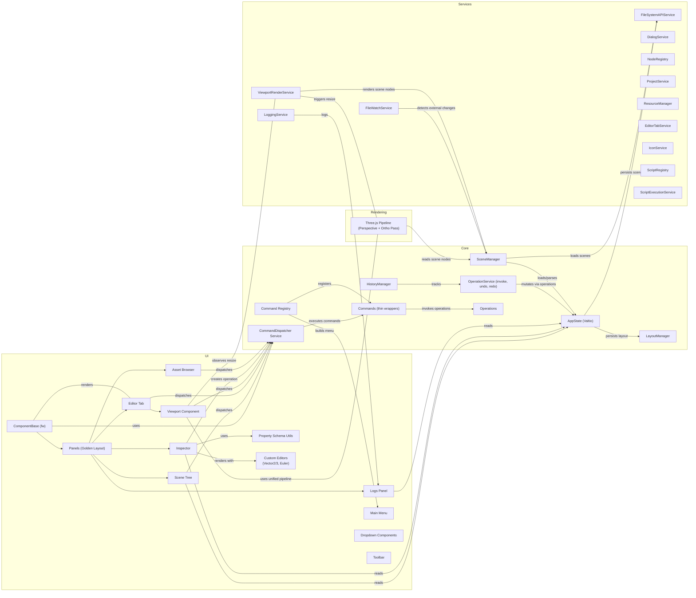
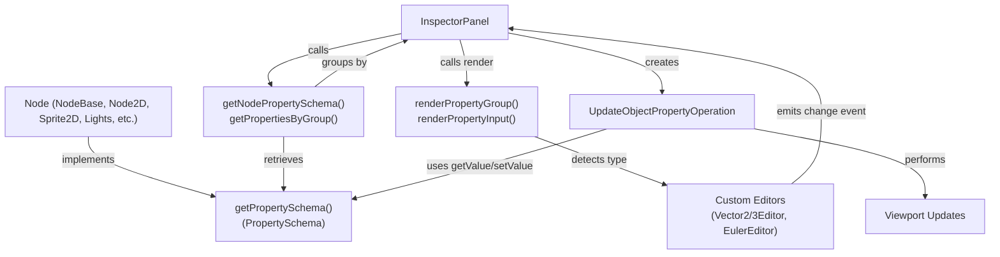
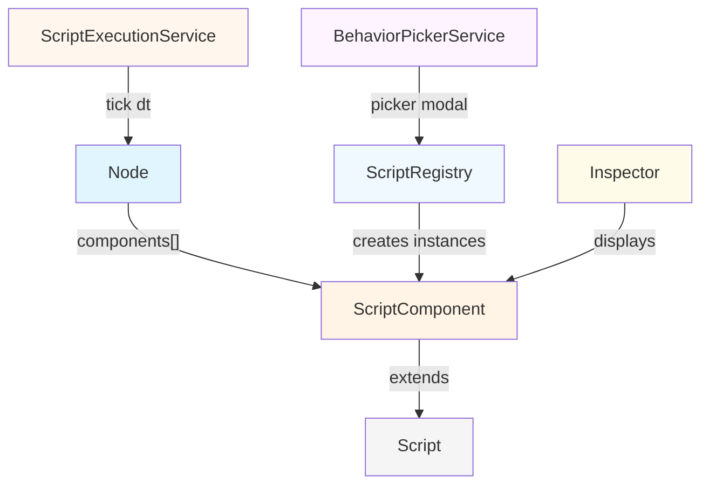
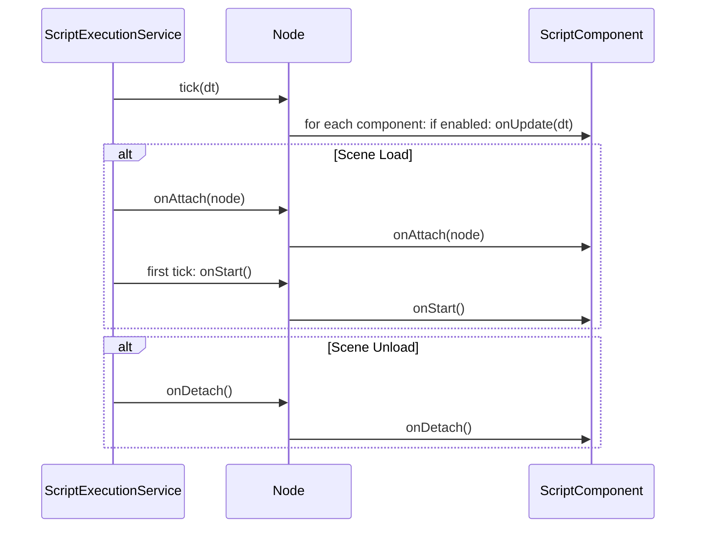
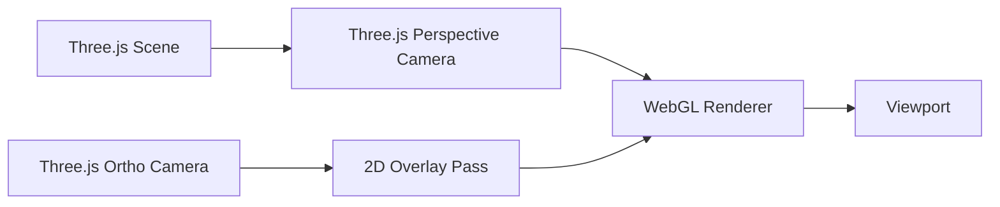
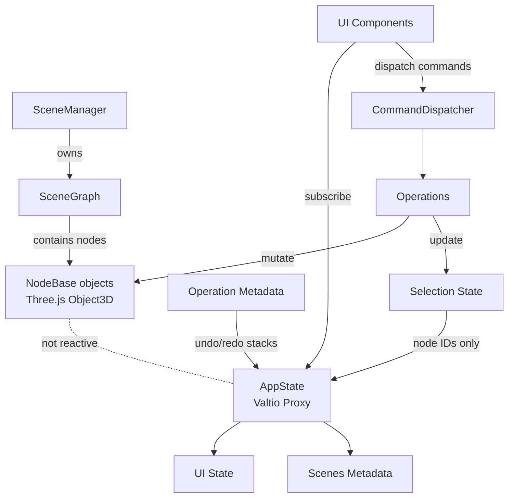

# Pix3 Architecture Diagrams

**This file is the visual/diagram layer** — mermaid system maps and a few
editor-only wiring notes. For authoritative prose the spec wins: node
properties → [node-types-reference.md](node-types-reference.md); property
schema → [property-schema-reference.md](property-schema-reference.md);
scripts/prefabs/animation/etc. → [pix3-specification.md](pix3-specification.md);
binding code rules → `AGENTS.md`. Don't duplicate those here — link them.

Skim the `##` headings and read only the diagram/section you need.

## Mermaid diagram

A Mermaid system diagram of the operations-first architecture (the CommandDispatcher is the entry point for all actions). Prose source of truth: [pix3-specification.md](pix3-specification.md).


```mermaid
flowchart LR
  subgraph UI
    A["ComponentBase (fw)"] --> B["Panels (Golden Layout)"]
    B --> C["Scene Tree"]
    B --> D["Editor Tab"]
    D --> D2["Viewport Component"]
    B --> E["Inspector"]
    B --> F["Asset Browser"]
    B --> G["Logs Panel"]
    E2["Property Schema Utils"]
    E -->|uses| E2
    E3["Custom Editors<br/>(Vector2/3, Euler)"]
    E -->|renders with| E3
    H["Main Menu"]
    I["Dropdown Components"]
    J["Toolbar"]
  end

  subgraph Core
    K["AppState (Valtio)"]
    L["OperationService (invoke, undo, redo)"]
    M["HistoryManager"]
    N["SceneManager"]
    O["LayoutManager"]
    P["CommandDispatcher Service"]
    Q["Commands (thin wrappers)"]
    R["Operations"]
    S["Command Registry"]
  end

  subgraph Services
    T["FileSystemAPIService"]
    U["FileWatchService"]
    V["DialogService"]
    W["LoggingService"]
    X["NodeRegistry"]
    Y["ProjectService"]
    Z["ResourceManager"]
    AA["ViewportRenderService"]
    AB1["EditorTabService"]
    AB2["IconService"]
    AB3["ScriptRegistry"]
    AB4["ScriptExecutionService"]
  end

  subgraph Rendering
    AC["Three.js Pipeline (Perspective + Ortho Pass)"]
  end

  A ---|renders| D
  D2 ---|uses unified pipeline| AC
  D2 ---|observes resize| AA
  AA ---|triggers resize| AC

  C -->|reads| K
  E -->|reads| K
  G -->|reads| K
  P -->|executes commands| Q
  Q -->|invokes operations| R
  L -->|mutates via operations| K
  M -->|tracks| L
  N -->|loads/parses| K
  S -->|registers| Q
  S -->|builds menu| H

  K -->|persists layout| O
  K -->|persists scenes| T
  N -->|loads scenes| T
  U -->|detects external changes| N

  W -->|logs| G
  AA -->|renders scene nodes| N

  %% All actions go through CommandDispatcher
  A -->|uses| P
  C -->|dispatches| P
  D -->|dispatches| P
  D2 -->|dispatches| P
  E -->|creates operation| P
  F -->|dispatches| P

  AC -->|reads scene nodes| N
```

> This is the **core operations-first view**. Newer domains (agent, llm, collab, animation-timeline, model-lab, localization, post-processing, ECS) aren't drawn here — see the [nodes-and-systems.md](nodes-and-systems.md) catalog and the `src/services/<domain>/` layout in `AGENTS.md`.

## Property Schema System

Pix3 uses a **property schema system** (Godot-inspired) for dynamic object inspector UI generation. This replaces hardcoded property editors with declarative type information.

### Architecture Flow


```mermaid
graph TD
  Node["Node (NodeBase, Node2D, Sprite2D, Lights, etc.)"]
  Schema["getPropertySchema()<br/>(PropertySchema)"]
  Inspector["InspectorPanel"]
  Utils["getNodePropertySchema()<br/>getPropertiesByGroup()"]
  Render["renderPropertyGroup()<br/>renderPropertyInput()"]
  Editors["Custom Editors<br/>(Vector2/3Editor, EulerEditor)"]
  Operation["UpdateObjectPropertyOperation"]
  Viewport["Viewport Updates"]

  Node -->|implements| Schema
  Inspector -->|calls| Utils
  Utils -->|retrieves| Schema
  Utils -->|groups by| Inspector
  Inspector -->|calls render| Render
  Render -->|detects type| Editors
  Editors -->|emits change event| Inspector
  Inspector -->|creates| Operation
  Operation -->|uses getValue/setValue| Schema
  Operation -->|performs| Viewport
```

Details, types, and authoring recipes: **[property-schema-reference.md](property-schema-reference.md)** (source: `packages/pix3-runtime/src/fw/`) and spec "Property Schema System". Editor-only note: Transform groups render via the `Vector2Editor`/`Vector3Editor`/`EulerEditor` web components (6-column grid, color-coded X/Y/Z axes).

## Command-Driven Menu System

Menu items are generated from registered commands using metadata. This pattern replaces hardcoded menu structures with a flexible, extensible approach.

### CommandMetadata Extension

```typescript
interface CommandMetadata {
  // ... existing properties ...
  readonly menuPath?: string; // 'edit', 'file', 'view', 'help'
  readonly shortcut?: string; // '⌘Z', 'Ctrl+S' (display only)
  readonly addToMenu?: boolean; // Include in main menu
  readonly menuOrder?: number; // Sort order (lower = earlier)
}
```

### Menu Generation Flow

1. Commands register with CommandRegistry at app startup
2. CommandRegistry.buildMenuSections() groups commands by menuPath and sorts by menuOrder
3. Pix3MainMenu loads sections and renders menu items
4. Menu clicks execute commands via CommandDispatcher

### Execution Path

```
User clicks menu item
  ↓
Pix3MainMenu.executeMenuItem(commandId)
  ↓
CommandDispatcher.execute(command)
  ↓
Preconditions checked → Command.execute()
  ↓
Operation performed via OperationService
  ↓
State updated → UI re-renders
```

### Example: Adding to Edit Menu

```typescript
export class MyCommand extends CommandBase<void, void> {
  readonly metadata: CommandMetadata = {
    id: 'edit.mycommand',
    title: 'My Command',
    menuPath: 'edit', // Groups under Edit menu
    shortcut: '⌘M',
    addToMenu: true,
    menuOrder: 10, // Sorts relative to other menu items
  };
  // ... implementation
}

// In editor shell:
this.commandRegistry.register(new MyCommand(dependencies));
```

The menu automatically updates without component changes.

## Implemented Node Types

The current node inventory (every type + all its properties) lives in
**[node-types-reference.md](node-types-reference.md)**; the capabilities view
(what each is for, engine-vs-game) is in
[nodes-and-systems.md](nodes-and-systems.md). Not duplicated here to avoid drift.

## Commands & Operations

The Command → Operation → history gateway is the binding pattern in `AGENTS.md`
("Commands and Operations") and CLAUDE.md's architecture-essentials. The concrete
command/operation set is code, not a doc list — read `src/features/<area>/`. Two
invariants worth stating once: create operations must set both
`selection.nodeIds = [nodeId]` and `selection.primaryNodeId = nodeId` (and keep
undo/redo selection cleanup symmetric); scene-create commands share
`CreateNodeBaseCommand` + `scene-command-utils.ts` (`requireActiveScene`,
created-node payload from selection).

## Script Component System

Pix3 includes a unified script component system for attaching runtime logic to nodes:


```mermaid
graph TD
  A["Node"]
  B["ScriptComponent"]
  C["Script"]
  D["ScriptRegistry"]
  F["ScriptExecutionService"]
  G["Inspector"]
  H["BehaviorPickerService"]

  A -->|"components[]"| B
  B -->|"extends"| C
  D -->|"creates instances"| B
  F -->|"tick dt"| A
  G -->|"displays"| B
  H -->|"picker modal"| D

  style A fill:#e1f5ff
  style B fill:#fff4e6
  style C fill:#f5f5f5
  style D fill:#f0f9ff
  style F fill:#fff7ed
  style G fill:#fefce8
  style H fill:#fdf4ff
```

Lifecycle sequence (`ScriptExecutionService` drives it):


```mermaid
sequenceDiagram
  participant S as ScriptExecutionService
  participant N as Node
  participant C as ScriptComponent

  S->>N: tick(dt)
  N->>C: for each component: if enabled: onUpdate(dt)

  alt Scene Load
    S->>N: onAttach(node)
    N->>C: onAttach(node)
    S->>N: first tick: onStart()
    N->>C: onStart()
  end

  alt Scene Unload
    S->>N: onDetach()
    N->>C: onDetach()
  end
```

Full model — `Script` base class, `ScriptRegistry` (`core:`/`user:` IDs),
component parameter schemas, serialization, `Add/RemoveComponentCommand`,
`SetPlayModeOperation` — is in spec "Script Component System" and the
[nodes-and-systems.md](nodes-and-systems.md) catalog. Don't restate it here.

## Runtime Stability Notes (2026-02-16)

- **ScriptExecutionService lifecycle fix**: stop/scene-switch now calls `onDetach()` for attached components and resets each component `_started` flag to guarantee `onStart()` runs on next play session.
- **ViewportRenderService performance fix**: removed the 100ms active-scene polling loop and replaced it with reactive subscription-based scene sync.
- **Subscription hygiene**: shell and status-bar components now store and dispose all Valtio/service subscriptions in `disconnectedCallback`, preventing listener accumulation across re-mounts/HMR.

## ViewportRenderService decomposition (2026-07-22)

`ViewportRenderService.ts` was an 8300+ LOC god-service. It's now a ~4.3k LOC facade over 10 owned collaborators under `src/services/viewport/*` (see the "UI Services" entry above for the full list and rationale). All ~45 consumers and the public API were unchanged — every extraction was a pure mechanical move verified against the existing `ViewportRenderService.spec.ts` (34 tests) plus `npm run type-check` and a full production `npm run build` at the end. No behavior change was intended or found. Render-loop invariants (dirty-tracking, the `assign2DVisualRenderOrder` call immediately before the 2D pass, mipmap-disabled 2D textures) are unchanged and still documented in `CLAUDE.md`'s "2D overlay rendering" / "Editor viewport renders on demand" sections.

## 2D/3D Navigation Mode

Pix3 supports specialized navigation modes for 2D and 3D authoring, controlled via `appState.ui.navigationMode`.

### 3D Navigation (Default)

- **Controls**: `OrbitControls` for rotation, panning, and zooming around a target.
- **Camera**: Perspective camera.
- **Visuals**: Full 3D grid and perspective depth.

### 2D Navigation

- **Controls**: Custom orthographic pan and zoom. Standard OrbitControls are disabled.
- **Camera**: Orthographic camera.
- **Behavior**: Handled via `pan2D` and `zoom2D` in `ViewportRendererService`. Trackpad gestures and wheel events are mapped to 2D transformations.
- **Integration**: Viewport interaction changes to flat, axis-aligned movement, ideal for working with `Layout2D` and 2D elements.

### Adaptive layer & navigation availability

The viewport adapts to what the active scene actually contains, so single-medium scenes never expose irrelevant controls. `deriveSceneLayerCapabilities` (`src/features/viewport/scene-layer-capabilities.ts`) classifies the scene graph into `{ has2D, has3D }` by scanning `nodeMap` for `Node2D` / `Node3D` (neutral nodes such as `PostProcess` / `AudioPlayer` count toward neither; empty or content-less scenes stay permissive so either kind can be added).

- **Toolbar** (`editor-tab` → `viewport-toolbar`): the layer-visibility buttons and the navigation-mode toggle appear only for a **mixed** scene (`isMixedScene` = `has2D && has3D`). A single-layer scene has nothing to reveal by hiding its only layer, so both layer buttons and the mode toggle are hidden; they reappear as soon as the other content type is added.
- **Navigation lock**: for the active tab, `editor-tab` re-derives capabilities on scene changes and dispatches `setNavigationMode` to snap navigation to the only available dimension. `ToggleNavigationModeCommand` refuses a target mode whose dimension is absent, and `ToggleLayer2D/3DCommand` preconditions only allow a toggle in a mixed scene — so the `N` / `2` / `3` shortcuts respect the lock too.
- **Effective rendering**: `ViewportRendererService` gates its render passes, raycasting, and adornments on _effective_ visibility (`showLayer2D/3D` **AND** the scene has that content, cached per `nodeDataChangeSignal`), so a 2D-only scene never paints the empty 3D band or grid.

## Service Layer

Pix3 implements a comprehensive service layer providing core functionality:

### Core Services

- **CommandDispatcher**: Primary entry point for all command execution with preconditions, telemetry
- **CommandRegistry**: Registers commands, builds menu sections, provides command lookup
- **OperationService**: Executes operations, manages undo/redo history, emits lifecycle events
- **ScriptRegistry**: Registers behaviors and controllers, creates instances, provides property schemas
- **BehaviorPickerService**: Shows modal dialog for selecting behaviors/controllers
- **EditorTabService**: Manages the lifecycle of editor tabs and synchronizes with Golden Layout

### Scene Services

- **SceneManager**: Manages SceneGraph objects, node lifecycle, scene loading/saving
- **NodeRegistry**: Maps node type strings to node classes for instantiation
- **ScriptExecutionService**: Runs game loop, calls tick on nodes, manages script lifecycle
- **AssetLoader**: Loads 3D models, textures, and other assets
- **ScriptCompilerService**: Handles on-the-fly compilation of scene scripts
- **ScriptCreatorService**: Provides UI and logic for creating new script components

### File System Services

- **FileSystemAPIService**: Wrapper for File System Access API
- **FileWatchService**: Monitors project directory for external changes, triggers reload
- **ProjectService**: Manages project root directory, project metadata
- **ResourceManager**: Manages loaded resources, handles caching

### UI Services

- **LayoutManager**: Manages Golden Layout panel configuration
- **ViewportRenderService** (`ViewportRendererService`, `src/services/viewport/ViewportRenderService.ts`): Handles Three.js rendering loop, resize, DPR, and navigation modes. It is a **facade over owned collaborators** under `src/services/viewport/*` — each is a plain class (not `@injectable()`, not DI-registered), constructed once by the facade and wired via closures for whatever it borrows back from the facade (renderer/scene/camera getters, `requestRender()`, etc., since those are recreated over the viewport's lifetime). The facade keeps every public method's original signature (thin delegates where the body moved) so none of its ~45 consumers changed. Collaborators, roughly in the order they sit in the render/interaction pipeline:
  - `ViewportGpuTimer` — WebGL2 timer-query GPU/CPU frame-cost sampling for the status-bar readout.
  - `viewport-framing-math` — pure geometry functions backing camera framing/zoom (no class, just exported functions).
  - `ViewportScreenshotter` — synchronous frame capture + transient framed/isolated captures for `captureScreenshot`/`captureFramedScreenshot`.
  - `ViewportSelection2DOverlayHud` — the floating DOM name/size/angle badges next to a 2D selection.
  - `ViewportPreviewTicker` — editor-only particle-preview and script-component-preview ticking (and the appearance overrides scripts push during preview).
  - `Viewport2DProxyRegistry` — owns every 2D node type's proxy visual (Group2D/Sprite2D/ColorRect2D/AnimatedSprite2D/TiledSprite2D/UIControl2D): the six visual `Map`s are public fields (read/written directly by the facade's `processNodeForRendering`/`updateNodeTransform` dispatchers), plus the create/sync/texture/opacity/render-order helpers. `configureSpriteTexture`/`getFrameThicknessWorldPx` are plain exported functions since the facade's remaining 3D-texture-sync code calls them too.
  - `Viewport3DContentSync` — Sprite3D/Particles3D/GeometryMesh texture sync and Sprite3D billboarding.
  - `ViewportAdornments` — 3D editor gizmos: selection boxes, per-type selection gizmos, camera/light target gizmos, and camera/light/particle billboard icons (maps are public fields for the same reason as the 2D registry).
  - `ViewportNavigation` — 2D camera pan/zoom/momentum state (the camera-state half; `Navigation2DController` is the separate, still-`@injectable()` input-gesture half that calls into this facade).
  - `ViewportPicking` — 2D/3D raycasting and hit-testing (marquee-rect selection, gizmo/icon raycasts, NDC conversion).
  - `ViewportTransformSession` — the in-progress 2D (`TransformTool2d`-driven) and 3D (`TransformControls`-driven) drag/transform state, and its commit to the undo stack via `OperationService`.

  What stays directly on the facade: the render loop itself (`requestRender`/`renderFrame`/`renderFrameBody`/`renderLoopTick`), pause/resume, `ensureInitialized`/`attachToHost`/`dispose`, scene-content sync (`syncSceneContent`/`processNodeForRendering`/`updateNodeTransform`) — these read/write several collaborators' public maps directly rather than through a redesigned method API, since that dependency shape (many call sites across facade dispatchers touching the same maps) doesn't fit a cleaner encapsulation without much larger, riskier diffs. See `.plans/code-quality-audit-2026-07-21.md` §8 Item 1 for the extraction rationale and ordering.
- **TransformTool2d**: 2D transform gizmo and interaction
- **FocusRingService**: Manages keyboard focus within editor UI
- **IconService**: Centralized management of SVG icons used across the UI

### Utility Services

- **DialogService**: Native-like dialogs for confirmations and prompts
- **LoggingService**: Centralized logging with level filtering (debug/info/warn/error)
- **TemplateService**: Provides scene templates and project templates
- **AssetFileActivationService**: Activates assets from browser into scene
- **ProjectScriptLoaderService**: Dynamically loads and registers scripts from the project directory

## Rendering Pipeline

Pix3 uses Three.js for all rendering:


```mermaid
graph LR
  A[Three.js Scene] --> B[Three.js Perspective Camera]
  C[Three.js Ortho Camera] --> D[2D Overlay Pass]
  B --> G[WebGL Renderer]
  D --> G
  G --> H[Viewport]
```

- **Three.js**: Primary rendering engine for 3D content, camera systems, lighting
- **Perspective Pass**: Renders 3D scene from perspective camera
- **Orthographic Overlay**: Renders HUD, gizmos, UI overlays

## UI Component Architecture

### Component Base Hierarchy

```
ComponentBase (from src/fw)
├── Pix3EditorShell (main app container)
│   ├── Pix3MainMenu (file/edit/view menus)
│   ├── Pix3Toolbar (action buttons)
│   └── Golden Layout Panels
│       ├── Pix3Panel (base panel)
│       ├── SceneTreePanel
│       │   └── SceneTreeNode (recursive)
│       ├── EditorTab (tab container)
│       │   └── ViewportPanel
│       │       └── TransformToolbar
│       ├── InspectorPanel
│       │   ├── Vector2Editor
│       │   ├── Vector3Editor
│       │   └── EulerEditor
│       ├── AssetBrowserPanel
│       │   └── AssetTree
│       ├── LogsPanel
│       └── Pix3Welcome (landing page)
├── Pix3Dropdown
├── Pix3DropdownButton
├── Pix3ToolbarButton
└── Pix3ConfirmDialog
```

### Component Guidelines

- Extend `ComponentBase` (not raw LitElement)
- Use light DOM by default, shadow DOM only when needed
- Inject services via `@inject()` decorator
- Subscribe to state changes via `subscribe()` from Valtio
- Dispatch commands via `CommandDispatcher`, never mutate state directly
- Split styles into separate `[component].ts.css` files
- Use centralized accent color CSS variables

## State Management Architecture


```mermaid
graph TD
  A[AppState<br/>Valtio Proxy]
  B[UI State]
  C[Scenes Metadata]
  D[Selection State]
  E[Operation Metadata]

  A --> B
  A --> C
  D -->|node IDs only| A
  E -->|undo/redo stacks| A

  F[UI Components]
  G[SceneManager]
  H[SceneGraph]

  F -->|subscribe| A
  F -->|dispatch commands| I[CommandDispatcher]

  G -->|owns| H
  H -->|contains nodes| J[NodeBase objects<br/>Three.js Object3D]
  J -.not reactive.- A

  I --> K[Operations]
  K -->|mutate| J
  K -->|update| D
```

**Key Principles:**

- Nodes are **NOT** in reactive state (managed by SceneManager in SceneGraph)
- State tracks only: UI state, scene metadata (file paths, names), selection (node IDs)
- All node mutations flow through Operations → SceneManager → SceneGraph
- UI subscribes to state changes, re-renders on updates

## File Watch Service

The FileWatchService monitors the project directory for external changes:

```mermaid
graph LR
  A[External File Change] --> B[FileWatchService<br/>Polling]
  B --> C{Change Detected?}
  C -->|Yes| D[ReloadSceneCommand]
  D --> E[OperationService]
  E --> F[SceneManager.reload()]
  F --> G[Scene Rebuilt]
  C -->|No| H[Continue Monitoring]
```

- Uses polling mechanism (FileSystem API doesn't provide native watch)
- Checks file modification timestamps
- Triggers `ReloadSceneCommand` when scene file changes
- Logs changes to LoggingService for debugging

## Logging Service

Centralized logging system with level-based filtering:

```typescript
// Usage in any component/service
import { inject } from '@/fw';

class MyService {
  @inject()
  private readonly logger!: LoggingService;

  doSomething() {
    this.logger.info('Operation started');
    // ... work ...
    this.logger.debug('Debug info', { data: 'value' });
    this.logger.warn('Warning condition');
    this.logger.error('Error occurred', error);
  }
}
```

**Features:**

- Four log levels: debug, info, warn, error
- Toggleable per-level filtering (via Logs Panel)
- Timestamp formatting with millisecond precision
- Scroll-to-bottom on new entries
- Clear all logs functionality

## Theme & Styling

Pix3 uses CSS custom properties for theming:

```css
:root {
  --pix3-accent-color: #ffcf33;
  --pix3-accent-rgb: 255, 207, 51;

  --color-bg-primary: #1e1e1e;
  --color-bg-secondary: #252526;
  --color-bg-tertiary: #2d2d2d;
  --color-text-primary: #cccccc;
  --color-text-subtle: #858585;
  --color-border: #3c3c3c;
  --color-input-bg: #3c3c3c;
}
```

**Guidelines:**

- Use `--pix3-accent-color` for direct hex references
- Use `rgba(var(--pix3-accent-rgb), opacity)` for transparency
- Avoid hardcoded colors in component styles
- Define semantic color variables in theme
